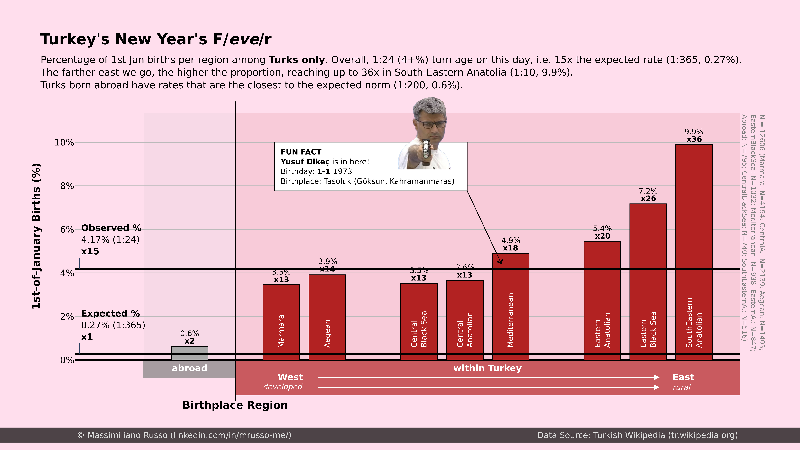
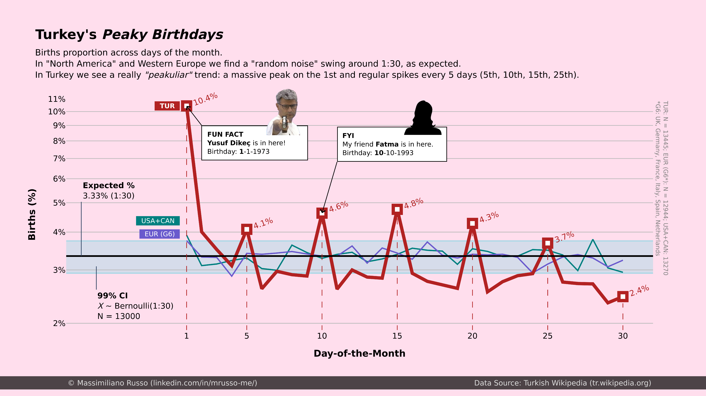

# :tr: Turkey's curious birth patterns
<!-- more -->

Almost 3 years ago I showed on LinkedIn how even the month of birth, a piece of data we generally ignore, can sometime hide a surprising pattern and a curious story (read it [here](https://t.ly/uKjhG)). Now I think I found the perfect sequel: **what if some other times the *day* of birth has something to say?**

## Context
The idea of this post came to me thanks to Fatma, a person I met on my tortuous Turkish learning journey. One day, during one of our chats, I asked about her birthday; she told me she didn't know hers. Well, clearly she has one (the 10/10, "how neat" you might say, and you'd be right…) but that's just a formality; nobody knows the actual one. I got to learn that for many years in Turkey lots of births took place at home and were reported much later – mainly due to poverty, weak infrastructures and lack of education. That was particularly true in rural areas and in Kurdish communities in the East (like in her case). Since parents were unsure of their children's exact birthday or couldn't prove it, it was quite common to be assigned arbitrary days, notably the 01-01.

## Data
This story immediately hooked me: my West-European mind couldn't believe it, I had to see it. I realized Turkish Wikipedia had the data I needed: birthdays and birthplaces for thousands of Turks.  
 *[Insert here "A few weeks later" with that French-accented voice from "Spongebob"]*   
I ended up with clean data for 80K people (born 1923-2008), of which 13K Turks.
By the way, is this a valid sample? While no one may question its size, some could argue that individuals born in wealthier and more developed regions might have better upbringings, greater opportunities for success, and ultimately a higher likelihood of being featured on Wikipedia. Therefore, I believe there could be an underrepresentation of the socio-economically disadvantaged groups, most likely people from rural areas, Eastern Turkey and minorities (e.g. Kurds).

## Analysis & Visualization
Now look at the plots.

{style="display: block; margin: 0 auto; width: 100%;"}

The first one shows the proportion of 01-01 births I found per region for all Turks, born in Turkey or abroad. Clearly the expected probability is 1/365 (0.27%). For Turks it's 15x more: 1/24 (4+%). And the value goes up, almost exponentially, as we move east (I over-simplified east=rural), up to 1/10 in South-Eastern Anatolia. Mind-boggling!

{style="display: block; margin: 0 auto; width: 100%;"}

The second one highlights the existence of "arbitrary birth days" beyond the 01-01. Take a look at the proportions of births per day, regardless of the month: you'd expect a roughly uniform distribution, each day having around 1/30 of the births, right? Indeed, North America and Western Europe swing around that marker. Turkey, instead, has a massive peak on the 1st, and regular spikes every 5 days: 5th, 10th, 20th, 25th. How satisfying is that?

## Conclusions
To conclude: this fact is no secret in Turkey, I didn't exactly discover fire. Furthermore, Turkey is not the only country where it happens, surely not. Yet I think it is worth sharing. Isn't it cool that birthdays can almost give away (be a testament of?) a country's socio-economic struggles?

